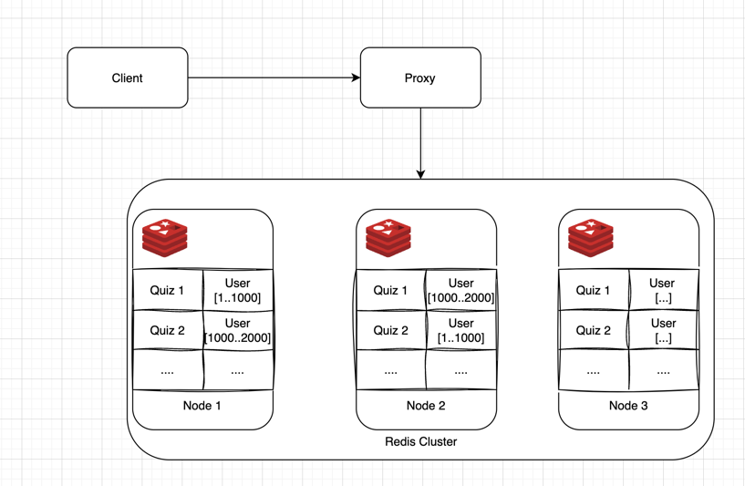

# Design

### Tech stacks:

- **BE programming language and framework: Java and Spring**
    - My preferred programming language and its framework
- **DBMS: Postgres**
    - **PostgreSQL** is highly reliable, scalable, and feature-rich, supporting complex queries, ACID compliance, and
      JSON data, making it versatile for both transactional and analytical workloads.
    - Alternative: MySQL
- **In-memory data cache: Redis**
    - **Redis** is ultra-fast, in-memory, and supports rich data structures, making it ideal for caching, real-time
      analytics, and high-performance, low-latency applications
    - Alternative: Memcached, Hazelcast, KeyDB
- **Event streaming platform**: **Kafka**
    - **Kafka** is a distributed platform for real-time data streaming, ideal for high-throughput, event-driven
      applications and scalable data pipelines.
- **Monitoring: ELK, Prometheus, Grafana**
    - **ELK** (ElasticSearch, Logstash, Kibana) is an industry de-facto for real-time log management and analytics,
      enabling search, visualization, and monitoring of data from various sources in one centralized platform
    - **Prometheus** is an open-source monitoring toolkit for collecting, querying, and alerting on time-series data.
    - **Grafana** is an open-source analytics and visualization tool for monitoring and exploring time-series data from
      multiple sources

### Assumptions:

According to [this](https://aws.amazon.com/solutions/case-studies/elsa-2021-case-study/) article, I will make some
assumption about the system:

- Monthly active user: 15 million
- Daily active user: 1 million
- Amount of active quiz: I will assume around 1000
- No limit on the number of user per quiz session
- The leaderboard will return the top-N ranking and there will be a function to retrieve a particular user's rank
- With each user submitting around 100 answers per day, 1 million DAU. The amount of request per second will be ~1200 requests/second, although the distribution may not spread evenly, let's assume the peak time will have 3 times more than the average => **3600 requests/second**
### User Participation

#### API Design:

| API                      | Description                    |
|--------------------------|--------------------------------|
| **POST /v1/quizs**       | Create a quiz                  |
| **GET /v1/quizs**        | Get all quiz                   |
| **POST /v1/quizs/users** | User join a quiz               |
| **GET /v1/quizs/users**  | Get all quiz a user has joined | 

This feature is straightforward, we will need a **Quiz service** that will handle the request of creating/joining quiz
from user/admin.
The data will be stored in Postgres.

**Quiz table:**

| ID  | Name   |
|-----|--------|
| 1   | Quiz 1 |
| 2   | Quiz 2 |
| ... | ...    |

**User table:**

| ID  | Name   |
|-----|--------|
| 1   | User 1 |
| 2   | User 2 |
| ... | ...    |

**User-Quiz table:**

| User ID | Quiz Id |
|---------|---------|
| 1       | 2       |
| 2       | 1       |
| ...     | ...     |

Table user-quiz is a many-to-many relationship table that references both
the user and quiz table. Since the data can become very large, we can use the Postgres's partitioning feature
to help distribute the data across multiple nodes in Postgres cluster setup.

### Real-Time Score Updates

#### API Design:

| API                                        | Description                     |
|--------------------------------------------|---------------------------------|
| **POST /v1/quizs/{quizId}/users/{userId}** | User submit an answer in a quiz |

User will have the ability to submit answer, when it happens, the request will be handled by **Quiz service**. If the
service confirm
the answer is correct, an update score event will be sent to Kafka. Kafka is necessary since it allows the event to be
consumed
by multiple consumer (can be hosted server or serverless function like AWS Lambda). This can help us keep the score
consistently between
multiple services. Having Kafka in between also helps with real-time processing, as we can increase the number of Kafka
partitions and our consumers,
leading to greater parallelism

Also, we can utilize our in-memory cache Redis to store the users's scores. This problem is a perfect match
for the **sorted set** data type in Redis.

#### Sorted set

A Redis sorted set is a collection of unique strings (members) ordered by an associated score.
Sorted sets are implemented via a dual-ported data structure containing both a skip list and a hash table, so every time
we add an element Redis performs an O(log(N)) operation.

Since there can be many users per quiz, it best to split the data of each quiz to **shard**. Because if we send all
requests to only
one Redis instance, it may not be able to handle.

A naive setup with 3 Redis nodes can be described like this:

There are many ways to assign a user to a shard, such as using a hash or join order. For simplicity in this assignment,
I will use a hash function to assign user to a node.

When the Redis consumer processes an event, it will determine the user's shard and send an update request. This setup
will help us increase
the write performance since write request will be evenly distributed to all nodes in the Redis cluster.

### Real-Time Leaderboard

| API                                       | Description                                                                                  |
|-------------------------------------------|----------------------------------------------------------------------------------------------|
| **GET /v1/quizs/{quizId}/users/{userId}** | Get user ranking in a quiz                                                                   |
| **GET /v1/quizs/{quizId}**                | Get quiz leaderboard (can change request param to change the size, i.e: top 10, top 100,...) | 

For the reading part, we can use scatter-gather approach to aggregate the top-N rankings and user rankings.

#### Get Quiz leaderboard:
Assuming we want a top 10 leaderboard, we will send a request to fetch top 10 players of that quiz in each shard.
Then at the application, we will aggregate the result

#### Get User Ranking:

First, we will fetch the user score and ranking in a quiz. Then, we will check how many players from other shards have higher or equal score. 
The result will be computed in the application.

Note that both operations above are cross-shard operation, so we can send the queries in parallel to increase performance 

### Monitoring

#### Logs monitoring

Logs from applications will be collected by Logstash, send to ElasticSearch and visualize by Kibana

#### Application metrics
Application metrics will be exposed through the Prometheus interface. In Spring, we can use the Actuator library to accomplish this. The metrics will be collected by Prometheus, and we can use Grafana to visualize them and set alerts.